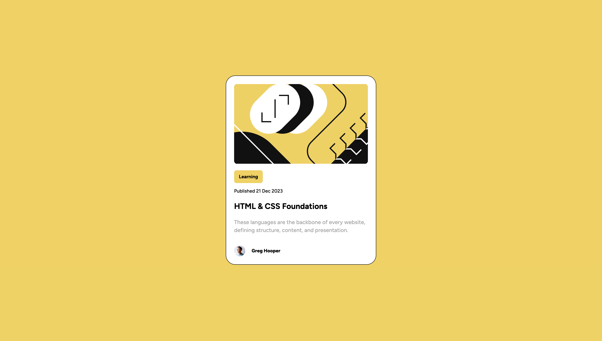

# Social Media Links Component

__This is a component for blog preview card.__

## Features
- The user should be able to hover & focus on the interactive components  
- The website adapts to device's viewport i.e. responsive



## Built With
- ReactJS
- Vite 
- Tailwind CSS
- CSS3

### Links

- [Github URL](https://github.com/vansh2308/blog-preview-card.git)
- [Live Site URL](https://blog-preview-card.vercel.app/)

## Usage

Navigate following commands in your terminal 

```bash
git clone https://github.com/vansh2308/blog-preview-card.git
cd ./social-media-links-component
npm i 
npm run dev 
```

Now type http://localhost:5173 in your browser. Bingo!!

## Author

- Github - [vansh2308](https://github.com/vansh2308)
- Website - [Vansh Agarwal](https://www.your-site.com)
- Frontend Mentor - [@vansh2308](https://www.frontendmentor.io/profile/vansh2308)
